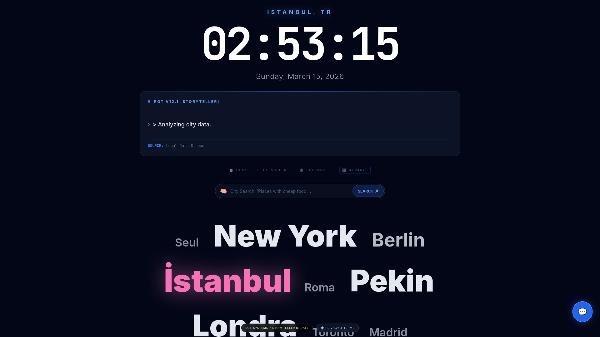
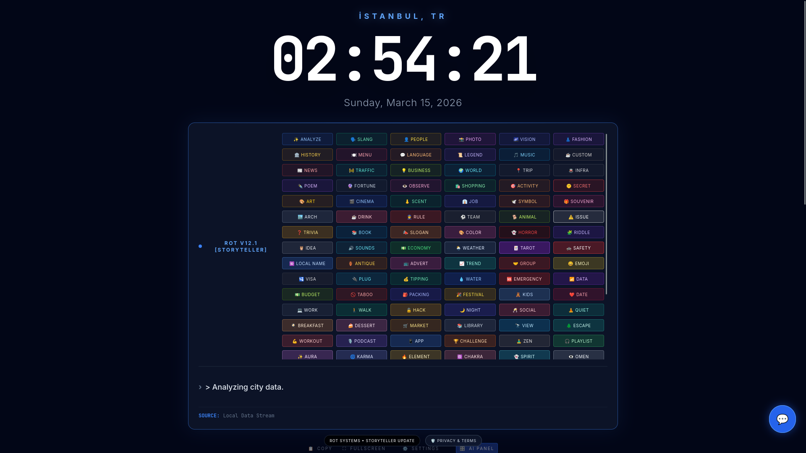
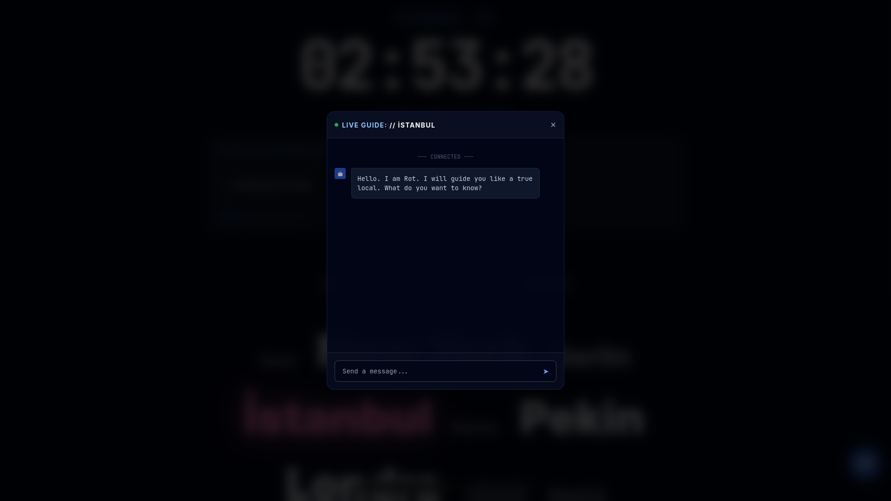
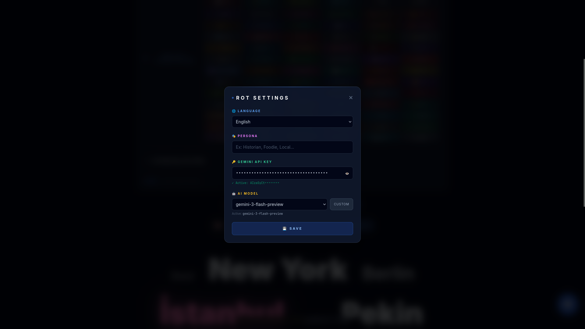

<div align="center">
  
# 🌍 ROT Systems - Storyteller Guide

### 🚀 The Ultimate AI-Powered Local Assistant & World Clock Interface

<br/>

[](https://rot-systems.vercel.app/)
[](https://github.com/AllLiveSupport/ROT-Systems/stargazers)
[](LICENSE)
[](https://buymeacoffee.com/alllivesupport)

<br/>


---

**✨ 4 Languages • 🔄 Real-Time Weather & Time • 📝 Live AI Chat • 🛡️ Secure & Free • 🖼️ Glassmorphism UI**

</div>

<br/>

---

## 📖 Overview

**ROT Systems** is a modern, responsive, and completely client-side AI city guide built on React and Vite. Experience time and culture around the world with an integrated Gemini AI interface. Whether you need a local history dive, a translation, or a local poet—ROT does it all. 

Unlike traditional platforms, this tool is built to let **YOU** bring your own API key, keeping your data entirely private, free, and completely within your control. 

---

## 🌟 Key Features

### 🚀 AI Integration at its Core
- **Bring Your Own Key (BYOK):** Use your own Google Gemini API key safely. Keys are stored locally on your device and are never sent to external servers.
- **Dynamic Persona Prompts:** Switch from a "Historian" to a "Foodie" to a "Local Gossip" in seconds.
- **Custom AI Models:** Supports the latest models (`gemini-2.5-flash-lite`, `gemini-3.1-pro-preview`) and lets you define custom model endpoints.

### 🛡️ Privacy First
- **Zero Backend:** Nothing is tracked. No user accounts, no telemetry, no tracking scripts. All data flows directly from your device to Google AI Studio.
- **Client-Side Only:** Powered entirely by React. 
- **Open Source:** Verify everything yourself. 

### 🎨 Modern & Immersive Interface
- **Dynamic Glassmorphism UI:** Background and UI elements adapt and respond to real-world time of day.
- **Multi-Lingual Capabilities:** Native support for English, Turkish, Spanish, and Russian. Everything changes interactively without refreshing.

## 📸 Visual Tour

<div align="center">

| **🌍 Global Clock Interface** | **💬 Live AI Chat & Storyteller** |
|:---:|:---:|
|  |  |
| *Real-time clocks with glassmorphism UI & dynamic backgrounds* | *Interact with the local storyteller persona* |

| **⚙️ Private Settings (BYOK)** | **🛡️ Built-in Privacy Focus** |
|:---:|:---:|
|  |  |
| *Manage API keys, models, and multi-language support (TR, EN, ES, RU)* | *Fully transparent, zero-backend architecture* |

</div>

<br/>

---

## 🛠️ Quick Start & Installation Guide

You can test this project immediately by spinning up the development environment.

1.  **Download the Code:**
    - Clone this repository or download the ZIP file and extract it.
    - `git clone https://github.com/AllLiveSupport/ROT-Systems.git`

2.  **Install Dependencies:**
    - Navigate to the folder and run:
      ```bash
      cd ROT-Systems
      npm install
      ```

3.  **Start Development Server:**
    - `npm run dev`
    - Open your browser to `http://localhost:5173`.

4.  **Add your Gemini API Key:**
    - Click the ⚙️ Settings icon at the bottom of the screen.
    - Input your API key (get one free from [Google AI Studio](https://aistudio.google.com/)).
    - Save and start chatting!

---

## ⚠️ Disclaimer

> [!CAUTION]
> **Legal Notice:** This tool is provided for **educational and personal purposes only**.

- 🤖 **AI Output:** ROT Systems utilizes Google Gemini. Responses are AI-generated and may occasionally be inaccurate.
- ⚖️ **Terms of Service:** You are solely responsible for complying with **Google API's** Terms of Service when using your own API key.
- 👤 **Liability:** The authors and contributors are not responsible for any misuse.

---

## 📜 License

This project is licensed under the **MIT License**. See the `LICENSE` file for more details.

---

<div align="center">

### ❤️ Support the Project

If this tool inspired you or helped you explore the world, consider supporting its development!

[](https://buymeacoffee.com/alllivesupport)
[](https://github.com/AllLiveSupport)

</div>
